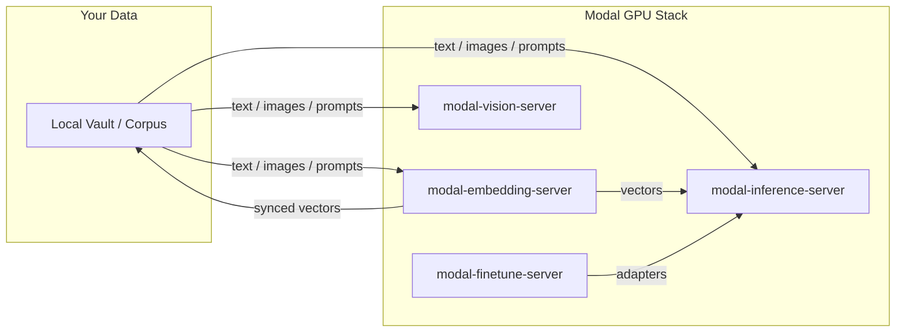

# Modal Inference Server

High-performance, GPU-accelerated LLM inference infrastructure deployed on Modal. This system provides a production-ready bridge between open-weight model registries and OpenAI-compatible API endpoints.

[](LICENSE)
[](https://modal.com)
[](https://modal.com/docs)
[](https://github.com/sponsors/kylebrodeur)

> **Operations:** for cold starts, cost control, hot-set semantics, slot gating, GGUF arch gotchas, and troubleshooting, read [docs/RUNBOOK.md](docs/RUNBOOK.md).

## Architecture Pillars

### 1. Routing
The server implements a sophisticated routing layer to maximize GPU throughput while maintaining low latency:
- **Hot-Set Routing**: Runs `llama-server` in router mode to co-host multiple model aliases within a single GPU container, eliminating eviction overhead for frequently used model pairs.
- **Slot-Gating**: Employs a real-time semaphore system based on actual `llama.cpp` slot grants, preventing the "silent clamping" common in generic inference wrappers.
- **Prefill Keepalive**: A custom proxy layer injects SSE keepalive comments during the prefill phase, ensuring streaming clients do not time out on large context prompts.

### 2. Serving
Model lifecycle and residency are managed through a deterministic catalog:
- **Registry-Driven**: All model configurations, quantizations, and revisions are pinned in `models.json`.
- **Hybrid Backends**: Switches between `Ollama`, upstream `llama.cpp`, and `vLLM` based on the model profile's requirements.
- **Persistent Storage**: Uses Modal Volumes for shared model weights and engine caches, ensuring fast cold-starts across container restarts.

### 3. Scale-to-Zero
Optimized for cost-efficiency without sacrificing reliability:
- **Dynamic Autoscaling**: Configured with `MODAL_INFERENCE_MIN_CONTAINERS=0`, allowing the infrastructure to scale to zero when idle.
- **Controlled Warmup**: Implements CUDA-graph bucket warming and pre-loading sequences to reduce the "first-token" latency of newly spawned containers.
- **Eager Shutdown**: Includes administrative tooling (`gpu_stop_eager`) to force-zero GPU workers during maintenance or cost-capping events.

## Quick Start

### Prerequisites
- [Modal](https://modal.com) account and CLI installed.
- [uv](https://github.com/astral-sh/uv) for fast Python dependency management.

### Setup & Deployment

1. **Authenticate with Modal**
   ```bash
   modal setup
   ```

2. **Bootstrap a Model**
   Download a pinned model from the catalog into the shared Modal Volume:
   ```bash
   uv run modal run server/modal_service.py::bootstrap_model --alias <model-alias>
   ```

3. **Deploy the Server**
   Deploy the service for a specific model profile:
   ```bash
   MODAL_INFERENCE_PROFILE=<model-alias> uv run modal deploy server/modal_service.py
   ```

## Configuration

The server is configured via environment variables and `models.json`. Every
serving knob uses the `MODAL_INFERENCE_` prefix (no bare names, so a shell
export can never leak across the family):

| Variable | Description | Default |
|----------|-------------|----------|
| `MODAL_INFERENCE_PROFILE` | The alias (or serve group) to serve | `""` |
| `MODAL_INFERENCE_APP_NAME` | Modal app name | `modal-inference-server` |
| `MODAL_INFERENCE_MAX_CONTAINERS` | Maximum GPU containers to scale out | `1` |
| `MODAL_INFERENCE_MIN_CONTAINERS` | Minimum GPU containers (0 for scale-to-zero) | `0` |
| `MODAL_INFERENCE_SCALEDOWN_WINDOW` | Seconds of inactivity before scaling down | `300` |
| `MODAL_INFERENCE_MAX_NUM_SEQS` | Concurrent slots per container | `8` |
| `MODAL_INFERENCE_GATE_WAIT_SECONDS` | Client wait time before returning a 429 | `240` |
| `MODAL_INFERENCE_GPU` / `MODAL_INFERENCE_GPU_COUNT` | GPU class / count fallback | `H100` / `1` |
| `MODAL_INFERENCE_MODEL_VOLUME` | Modal Volume holding model weights | `modal-inference-server-models` |
| `MODAL_INFERENCE_ENGINE_CACHE_VOLUME` | Modal Volume for engine caches | `modal-inference-server-engine-cache` |
| `MODAL_INFERENCE_USAGE_VOLUME` | Modal Volume for the usage ledger | `modal-inference-server-usage` |
| `MODAL_INFERENCE_HF_SECRET` | Hugging Face secret name | `modal-inference-server-huggingface` |
| `MODAL_INFERENCE_DASHBOARD_SECRET` | Dashboard secret name | `modal-inference-server-dashboard` |

The three Modal **Volume** names and the two **Secret** names are
workspace-global, so a second deployment in one workspace MUST override them
(see [Deploying more than one lane](#deploying-more-than-one-lane)).

## Metrics (opt-in)

Set `MODAL_INFERENCE_METRICS=1` to push app-level points into your own
VictoriaMetrics (or InfluxDB; same line protocol) via the vendored
`vm_metrics.py`, which is baked into the serve image. `MODAL_INFERENCE_VM_URL`
picks the endpoint (default `http://localhost:8428`); `MODAL_INFERENCE_DEVICE_TAG`
labels each point's `device` tag (fallback: the app name).

Emissions: `inference_request` (tags `path=chat_completions`, `status` = class
like `2xx`), `inference_prompt_tokens` and `inference_completion_tokens`
(token counts, emitted only when > 0). No `inference_ttft_seconds`: the proxy
tracks no first-token timestamp, so ttft is skipped on purpose. Strictly
additive to the `/usage` ledger: the ledger stays the source of truth for the
dashboard and cost math. With the env off, every emission site is a no-op.

## Operator CLI

The repo ships a `modal-inference` CLI (installed with `uv sync` via the `[project.scripts]` entry), which wraps the full operational lifecycle:

```bash
modal-inference setup                          # one-time: writes ~/.config/modal-inference/config.json
modal-inference use <alias>                    # switch: deploy if needed, then warm
modal-inference warm | health | status         # act on the currently deployed target
modal-inference shutdown                       # scale GPU to zero now (dashboard stays up)
modal-inference models list|add|update|enable|disable
modal-inference tuning list|add|activate|compare|flex
modal-inference stats | pricing | cost compare
modal-inference doctor                         # full-chain health + drift report
modal-inference install                        # write the Pi/OMP provider config (--check to verify, --pi-only/--omp-only)
```

## Warm-on-Session-Start (Pi/Extras)

The service scales to zero, so the first request of a session pays a cold boot (150-470s, measured). Drop [`extensions/modal-warm.ts`](extensions/modal-warm.ts) into your Pi `<agent-dir>/extensions/` to kick off the warm at session start and hide that wait:

```bash
cp extensions/modal-warm.ts ~/.pi/agent/extensions/
# or, for a project-scoped agent dir (PI_CODING_AGENT_DIR set inside a project):
cp extensions/modal-warm.ts <project>/<agent-dir>/extensions/
```

One probe per process. Skips sessions whose model is not on the provider. Never throws into the session. Distinguishes auth-rejected (check `MODAL_PROXY_TOKEN`) from still-booting, and reports the served hot set on success.

## Provisioning Secrets
```bash
mtk secrets check
mtk secrets create --pkg inference

uvx modal secret create inference-auth-secret API_TOKEN=$(openssl rand -hex 32)
uvx modal secret create modal-inference-server-dashboard MODAL_INFERENCE_DASHBOARD_TOKEN=$(openssl rand -hex 32)
uvx modal secret create modal-inference-server-huggingface HF_TOKEN=hf_...
```

`server/secrets.toml` is the source of truth for secret names and keys.

## Deploying more than one lane

Modal app names, Volume names, and Secret names are **workspace-global**. Two
inference deployments in the same workspace must not share them, so each lane
composes its own names through `deploy.json` (the overlay/`<slug>-<pkg>`
convention). The knobs that MUST differ per lane:

| Knob | Why it must differ |
|------|--------------------|
| `MODAL_INFERENCE_APP_NAME` | Modal app name (also the Modal URL label) |
| `MODAL_INFERENCE_MODEL_VOLUME` | shared weights would be clobbered by a concurrent bootstrap |
| `MODAL_INFERENCE_ENGINE_CACHE_VOLUME` | engine-cache corruption across runtimes |
| `MODAL_INFERENCE_USAGE_VOLUME` | the ledger + `runtime-overrides.json` are per-lane state |
| `MODAL_INFERENCE_HF_SECRET` | token scoping per lane |
| `MODAL_INFERENCE_DASHBOARD_SECRET` | dashboard login token per lane |

In particular, `runtime-overrides.json` (written by `tuning flex` and the
dashboard) lives on the usage Volume as one `{alias: knobs}` map. If two lanes
share that Volume, flexing lane A silently changes what lane B boots at its
next container start. Give each lane its own usage Volume.

Environment variables themselves are per-container, so they never collide
across lanes at runtime; the names above are the workspace-global surfaces that
do.

## Examples

See [`examples/`](examples/) for a minimal, stdlib-only client (`chat_example.py`) you can copy directly into your own stack.

## Contributing

See [CONTRIBUTING.md](CONTRIBUTING.md) for ground rules and workflow.

---

---

Built by [Kyle Brodeur](https://kylebrodeur.com) · Model-selection deep-dive: [Choose the Right Embedding Model for Your Data](https://kylebrodeur.substack.com/p/choose-embedding-model-for-your-data)

## Lifecycle hooks

This package fires a lifecycle hook seam (vendored verbatim from
[modal-shared-libs](https://github.com/kylebrodeur/modal-shared-libs),
refreshed by `mtk libs sync`): one shared instance named
`modal-inference-server`, closed tag set ``lane.boot.pre` / `lane.boot.post` / `request.pre` / `request.post` / `inject.pre``.

Engine boot: lane.boot.pre around each GPU-engine boot helper ({runtime, profile}), lane.boot.post on success (+ok: true). Proxy: request.pre at the catch-all's entry (method, path), request.post before every return path (method, path, status) - the 401 deny and the 502 upstream failure each still fire. Body seam: inject.pre hands a handler the parsed, MUTABLE chat body for a `POST /chat/completions` before it is forwarded; mutate it in place (e.g. prepend a system message) and the proxy re-serializes. It fires only when a handler is registered, so an unwired deployment pays no parse.

```python
from modal_service import hooks


@hooks.on("request.post")
def observe(method, path, status): print(path, status)


@hooks.on("inject.pre")
def recall(payload, request):
    payload.setdefault("messages", []).insert(0, {"role": "system", "content": "recalled context"})
```

The tag set changes only in this package's releases.

## Operator commands (`mtk`)

This package ships an `mtk inference` command group in
`server/mtk-commands.toml`: a passthrough to this repo's own CLI, so
`mtk inference <anything...>` runs `uv run modal-inference <anything...>` in
the checkout with argv preserved verbatim (the CLI's own commands gate
themselves). See [modal-toolkit](https://github.com/kylebrodeur/modal-toolkit)
for the fleet-level commands and the per-package command table.

## Part of the Modal Toolkit

Seven standalone Modal utilities from the same author, each extractable and deployable on its own.

- **[modal-embedding-server](https://github.com/kylebrodeur/modal-embedding-server):** GPU-backed embeddings with a monotonic sync protocol for private-first search.
- **[modal-vision-server](https://github.com/kylebrodeur/modal-vision-server):** Generic vision classification: pick your model (open_clip or transformers weights), your segmenter (SAM 2.1 or none), and your fast gate (self, cheap CLIP, deterministic script, or external endpoint). The BioCLIP plant stack ships as the example card.
- **[modal-finetune-server](https://github.com/kylebrodeur/modal-finetune-server):** Profile-driven LoRA fine-tune and GGUF pipeline with an honest eval gate.
- **[modal-vault-server](https://github.com/kylebrodeur/modal-vault-server):** Hosted Obsidian vault + MCP memory plane: server-side clone via Headless Sync, searchable by MCP-speaking agents.
- **[modal-toolkit](https://github.com/kylebrodeur/modal-toolkit):** One operator CLI (`mtk`) that runs the fleet: `doctor`, `secrets`, `warm --all`, `shutdown --all`, `cost`, `flow`, `dashboard`.
- **[embed-eval-on-your-vault](https://github.com/kylebrodeur/embed-eval-on-your-vault):** the eval-first pattern (benchmark embedding models on your own data before you deploy) as a single-file, zero-dependency harness.

## Ecosystem Flowchart




## Built on Modal

These packages run on [Modal](https://modal.com), the serverless GPU platform. If you build something with them, share it in the [Modal Slack](https://modal.com/slack) community (`#show-and-tell`). Issues and PRs welcome here on GitHub.

## License

Apache-2.0: see [LICENSE](LICENSE).
