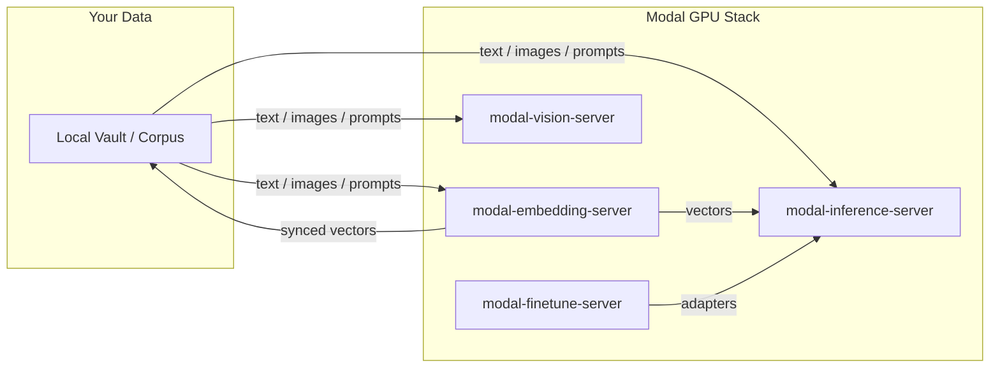

# Modal Inference Server

High-performance, GPU-accelerated LLM inference infrastructure deployed on Modal. This system provides a production-ready bridge between open-weight model registries and OpenAI-compatible API endpoints.

[](LICENSE)
[](https://modal.com)
[](https://modal.com/docs)
[](https://github.com/sponsors/kylebrodeur)

> **Operations:** for cold starts, cost control, hot-set semantics, slot gating, GGUF arch gotchas, and troubleshooting, read [docs/RUNBOOK.md](docs/RUNBOOK.md).

## Architecture Pillars

### 1. Routing
The server implements a sophisticated routing layer to maximize GPU throughput while maintaining low latency:
- **Hot-Set Routing**: Utilizes `llama-server` in router mode to co-host multiple model aliases within a single GPU container, eliminating eviction overhead for frequently used model pairs.
- **Slot-Gating**: Employs a real-time semaphore system based on actual `llama.cpp` slot grants, preventing the "silent clamping" common in generic inference wrappers.
- **Prefill Keepalive**: A custom proxy layer injects SSE keepalive comments during the prefill phase, ensuring streaming clients do not time out on large context prompts.

### 2. Serving
Model lifecycle and residency are managed through a deterministic catalog:
- **Registry-Driven**: All model configurations, quantizations, and revisions are pinned in `models.json`.
- **Hybrid Backends**: Seamlessly switches between `Ollama`, upstream `llama.cpp`, and `vLLM` based on the model profile's requirements.
- **Persistent Storage**: Uses Modal Volumes for shared model weights and engine caches, ensuring fast cold-starts across container restarts.

### 3. Scale-to-Zero
Optimized for cost-efficiency without sacrificing reliability:
- **Dynamic Autoscaling**: Configured with `MIN_CONTAINERS=0`, allowing the infrastructure to scale to zero when idle.
- **Controlled Warmup**: Implements CUDA-graph bucket warming and pre-loading sequences to reduce the "first-token" latency of newly spawned containers.
- **Eager Shutdown**: Includes administrative tooling (`gpu_stop_eager`) to force-zero GPU workers during maintenance or cost-capping events.

## Quick Start

### Prerequisites
- [Modal](https://modal.com) account and CLI installed.
- [uv](https://github.com/astral-sh/uv) for fast Python dependency management.

### Setup & Deployment

1. **Authenticate with Modal**
   ```bash
   modal setup
   ```

2. **Bootstrap a Model**
   Download a pinned model from the catalog into the shared Modal Volume:
   ```bash
   uv run modal run server/modal_service.py::bootstrap_model --alias <model-alias>
   ```

3. **Deploy the Server**
   Deploy the service for a specific model profile:
   ```bash
   MODEL_PROFILE=<model-alias> uv run modal deploy server/modal_service.py
   ```

## Configuration

The server is configured via environment variables and `models.json`:

| Variable | Description | Default |
|----------|-------------|----------|
| `MODEL_PROFILE` | The alias of the model to serve | `""` |
| `MAX_CONTAINERS` | Maximum GPU containers to scale out | `1` |
| `MIN_CONTAINERS` | Minimum GPU containers (set to 0 for scale-to-zero) | `0` |
| `SCALEDOWN_WINDOW`| Seconds of inactivity before scaling down | `300` |
| `GATE_WAIT_SECONDS`| Client wait time before returning a 429 | `240` |

## Operator CLI

The repo ships a `modal-inference` CLI (installed with `uv sync` via the `[project.scripts]` entry), which wraps the full operational lifecycle:

```bash
modal-inference setup                          # one-time: writes ~/.config/modal-inference/config.json
modal-inference use <alias>                    # switch: deploy if needed, then warm
modal-inference warm | health | status         # act on the currently deployed target
modal-inference shutdown                       # scale GPU to zero now (dashboard stays up)
modal-inference models list|add|update|enable|disable
modal-inference tuning list|add|activate|compare|flex
modal-inference stats | pricing | cost compare
modal-inference doctor                         # full-chain health + drift report
```

Also: `modal-inference-install` writes the Pi/OMP provider config (`uv run modal-inference-install --check` to verify only).

## Warm-on-Session-Start (Pi/Extras)

The service scales to zero, so the first request of a session pays a cold boot (150–470s, measured). Drop [`extensions/modal-warm.ts`](extensions/modal-warm.ts) into your Pi `<agent-dir>/extensions/` to kick off the warm at session start and hide that wait:

```bash
cp extensions/modal-warm.ts ~/.pi/agent/extensions/
# or, for a vault-scoped agent dir:
cp extensions/modal-warm.ts <vault>/.vault-mind/.pi/agent/extensions/
```

One probe per process. Skips sessions whose model is not on the provider. Never throws into the session. Distinguishes auth-rejected (check `MODAL_PROXY_TOKEN`) from still-booting, and reports the served hot set on success.

## Examples

See [`examples/`](examples/) for a minimal, stdlib-only client (`chat_example.py`) you can copy directly into your own stack.

## Contributing

See [CONTRIBUTING.md](CONTRIBUTING.md) for ground rules and workflow.

---

---

Built by [Kyle Brodeur](https://kylebrodeur.com) · Model-selection deep-dive: [Choose the Right Embedding Model for Your Data](https://kylebrodeur.substack.com/p/choose-embedding-model-for-your-data)

## Part of the Modal Toolkit

Four standalone Modal utilities from the same author, each extractable and deployable on its own.

- **[modal-embedding-server](https://github.com/kylebrodeur/modal-embedding-server):** GPU-backed embeddings with a monotonic sync protocol for private-first search.
- **[modal-vision-server](https://github.com/kylebrodeur/modal-vision-server):** Specialized vision classification (BioCLIP-2) with adaptive SAM 2.1 segmentation.
- **[modal-finetune-server](https://github.com/kylebrodeur/modal-finetune-server):** Profile-driven LoRA fine-tune and GGUF pipeline with an honest eval gate.

## Ecosystem Flowchart



## License

Apache-2.0 — see [LICENSE](LICENSE).
